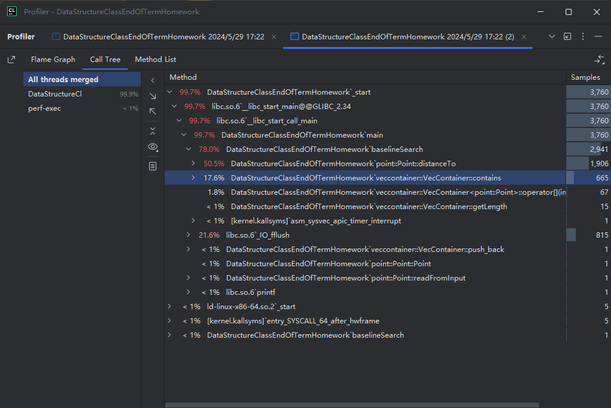
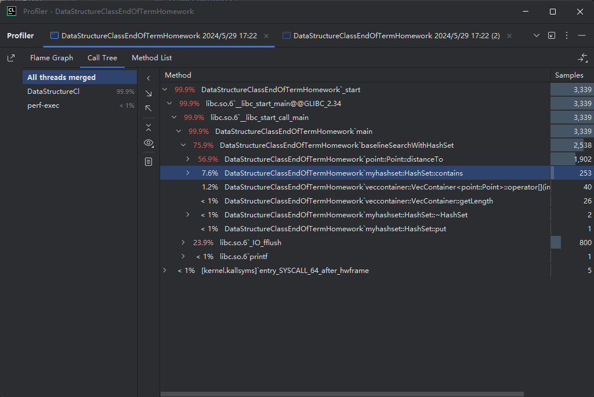
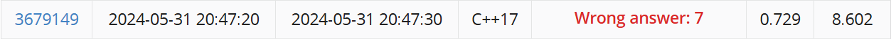
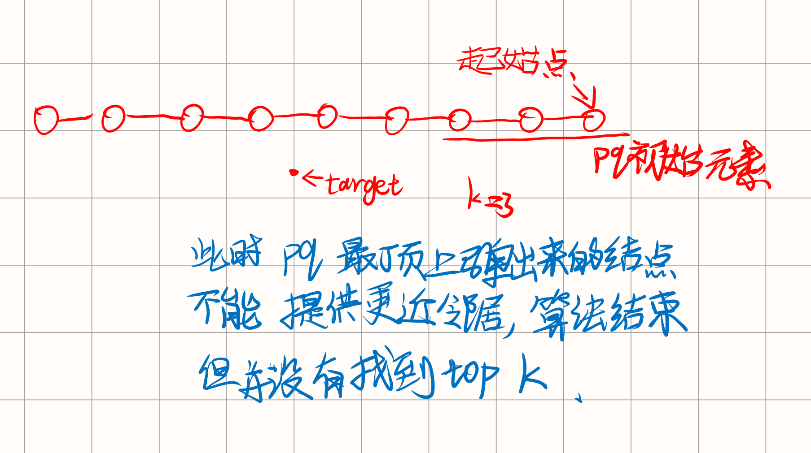
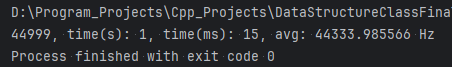
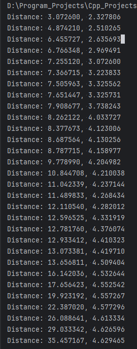
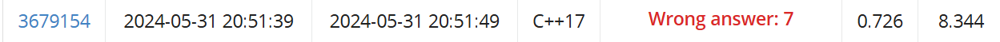
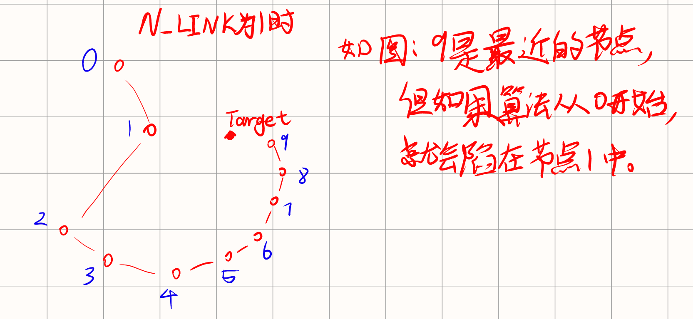
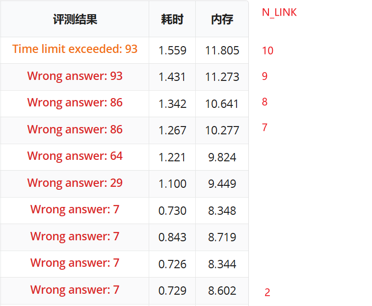

[//]: # (报告制作思路)

注释尽量详细, 写报告用

# Baseline

首先我制作了 `baselineSearch` 函数, 其在测试集上的效率是 ...

[//]: # (补充省略号内容, 看 baselineSearch 注释)



发现选中项 contains 有不必要的时间占用.

# Baseline With HashSet

于是我将 HashSet 应用到 `baselineSearch` 索引的保存中, 并将 hashSet 设置为 1000.



得到了小许优化.

## 结果



# HNSW

通过[向量数据库](https://www.bilibili.com/video/BV14u4y1A7fB?p=4)视频, 我了解到了 HNSW 算法,
用于查找与目标向量最接近的向量.

## HNSW-KNN

但是我第一眼看去 HNSW 只能用于查找最近的一个向量, 并没有直接看出如何使用 HNSW 如何应用到 KNN 问题上.

### 优先队列

于是我问 gpt, 它说用优先队列来实现最近 k 个节点的获取.

优先队列中堆顶是距离目标点最远的点, 每次弹出堆顶, 然后如果弹出的节点有比此节点距离目标向量更近的邻居节点,
且此邻居节点不在优先队列内, 则将邻居节点添加进优先队列中.

### 优先队列包含的问题

如果搜索完, 结果没有 k 个, 可能的情况为:

1. 层中没有足够的点.
2. 搜索的起始点和目标点足够近.

### 优先队列问题的解决方案

第一点实际上没什么问题, 此情况一般只会在层构建初期才会产生, 就算在查询是出现此情况, 也影响不大.

对于第二点, 我自己想的思路是, 如果优先队列的元素数量没有达到 k 那就不检查邻居节点与目标向量的距离,
直接放入堆中 (重复性还是要检查的).

### 解决优先队列比较里的重复计算和重复性检查

要把优先队列应用下来, 还需要一个步骤: 缓冲每个节点和目标向量的距离.
原因是在优先队列中, 需要进行多次比较, 若不缓冲则会造成重复的运算.

对此我的设计是:
每个 Layer 维护一个独特的 `searchBatch:int`, 用于记录搜索批次, 每调用一次 `searchNearestTopK`, 此值自增.
Layer 中的每个 GraphNode 添加两个字段: `{ batch:int, inQueue:bool, distance:double }`,
分别代表缓冲的距离所属的搜索批次, 是否在队列里和缓冲的距离.

这三个字段不仅可以减少重复的计算, 还能用于[重复性检查](#优先队列问题的解决方案),
如果 `batch != searchBatch`, 就说明此节点在此次搜索中没有被涉及到,
此时 inQueue 和 distance 的值需要重新设置和计算.
如果 `batch == searchBatch`, 说明此次搜索层涉及过此节点, 那么 distance 字段可以直接使用, inQueue
字段用来判断此节点是否在优先级队列里, 防止反复添加.

最后放进优先队列里的是 GraphNode 的指针, 同时传入一个比较函数给优先队列, 由于取得 distance 并比较.
此处的想法一开始困扰了我一会, 我的几个原有的想法是:

1. 优先队列里存放 GraphNode 的包裹类.
2. 优先队列里存放 GraphNode 在 Layer 中的索引.

这几个想法由于以下缺陷而取消了:

1. 包裹类内存开销太大, 每次搜索都要进行多次内存的分配, 且查找值时不方便.
2. 如果只传入索引, 那么在比较时获取 distance 的值就需要一个 Layer 的引用, 于是在比较函数中就需要拥有
   Layer 的指针, 但是成员函数并不能作为函数指针传递, 于是获取 Layer 的引用就比较困难.

### 层内搜索步骤

搜索分为层内和多层, 这里先介绍单层的搜索, 层间搜索的切换稍后再讲.

**注意**:
以下步骤中,

- 每次使用节点的缓冲距离时, 需要提前计算.
- 每次从优先级队列中放入值前需要设置 inQueue.
- 每次从优先级队列中弹出值时需要设置 inQueue.

下文省略不谈.

步骤为:

1. 如果 Layer 的节点数量小于等于 k, 直接把 Layer 中所有的节点索引返回.
2. 更新 searchBatch 的值.
3. 从 Layer 中的前 k 个节点开始, 把这些节点放入优先级队列(pq: `PriorityQueue<GraphNode *>`,
   堆顶存放着距离最远的节点).
4. 循环, 直到 pq 为空 (pq 为空估计不会出现):
    1. 弹出 pq 顶上的元素 node.
    2. 遍历 node 的每个邻居, 当邻居的距离比 node 近时才添加此邻居到 pq 内.
    3. 如果此 node 没有邻居被添加, 结束循环.
5. 丢弃 pq 中的元素, 直到 pq 剩下 k 个元素.
6. 将这 k 个元素倒序放在 Vec 中 (distance 字段最小的放在 Vec 0 号位置), 返回.

### 错误, 推倒重来

在设计层间切换时, 我发现以上方法在层内搜索时的一个致命的错误:



### 靠近后拓展

上述方法失败之后, 我想出了另外一个方法: 先在层内找到距离目标向量最接近的节点, 然后以此节点为起始节点,
拓展 k 个节点, 以此实现 TopK 问题.

拓展的方式是给定一个节点, 从此节点开始以广度优先的方式增添节点, 直到增添到了 k 个节点, 返回这些节点所代表的值.

此方法实践后, 速度大幅提升, 再把链表的取值用自制迭代器的形式进行优化, 最终在测试集上的总搜索速度可以压缩到
1 秒左右, 但准确率不尽人意.

速度(avg 表示每秒进行的搜索次数):



准确率样本(左边是当前方法搜索出来的向量和目标向量的距离, 右边是 Baseline 结果):



由图可知, 此拓展方式产生的 TopK 召回率结果不太好.

### 查阅论文和开源项目

论文: [Efficient and robust approximate nearest neighbor search using Hierarchical Navigable Small World graphs](https://arxiv.org/pdf/1603.09320)

开源项目: [hnswlib](https://github.com/nmslib/hnswlib)

我看了一下此项目中的 [knn 搜索方法: searchBaseLayerST](../lib/hnswlib/hnswalg.h), 把此方法的几个分支简化后,
方法在搜索时使用了两个优先级队列, 一个优先级队列是正序的, 另一个是倒序的.

这个搜索思路是:

1. 同时维护一个结果优先级队列 rq 和一个候选者优先级队列 cq, 结果优先级队列就是返回值对应的序列,
2. 把起始节点放入 rq 和 cq.
3. 循环, 直到 cq 为空:
    1. 从 cq 中取出距离目标向量最短的节点 nn.
    2. 如果 nn 比下界还要大 (下界指的是 rq 中距离目标向量最远的节点对应的距离) 则结束循环.
    3. 遍历所有 nn 的没被探索过的邻居 ng: (被加入到 rq 或者 cq 过则说明被探索过)
        1. 如果 ng 的距离比下界短则把 ng 加入 cq 和 rq.
4. 从 rq 中取出 k 个节点作为返回值.

## 结果



第一次提交时, 此分数让我有点失望, 7 分的分数驱使我不断反复创建二维数据集反复测试准确性
(使用[main2](../HnswTrial.cpp)), 在各种测试集上, 其显示的结果大致都如以下输出, 召回率十分低:

```
            HNSW   Baseline                   HNSW  Baseline
Node:       7399:      6164, 	Distance: 2.969491, 2.327806
Node:        271:      3151, 	Distance: 4.204982, 2.510265
Node:       2427:      7996, 	Distance: 4.331919, 2.635693
Node:       7636:      7399, 	Distance: 4.670664, 2.969491
Node:       7415:      5568, 	Distance: 5.209835, 3.072600
Node:       5968:      7346, 	Distance: 5.450563, 3.223833
Node:       7769:       974, 	Distance: 5.527832, 3.325562
Node:        407:      5588, 	Distance: 5.820290, 3.325731
Node:       2921:       766, 	Distance: 5.860978, 3.738243
Node:       3653:      4222, 	Distance: 5.956301, 4.033727
Node:         56:      6309, 	Distance: 5.979393, 4.123006
Node:       7477:      3586, 	Distance: 6.249059, 4.130256
Node:       6353:      3771, 	Distance: 6.266310, 4.158977
Node:        199:       271, 	Distance: 6.335025, 4.204982
Node:        143:      6780, 	Distance: 6.611314, 4.210038
Node:       5940:      5613, 	Distance: 6.762243, 4.237144
Node:       5657:      4479, 	Distance: 6.766348, 4.268434
Node:       6398:      3673, 	Distance: 6.857042, 4.282012
Node:       5173:      2427, 	Distance: 6.887219, 4.331919
Node:       4997:      4762, 	Distance: 7.156574, 4.376074
Node:       7049:      3239, 	Distance: 7.348852, 4.410323
Node:       3473:      3915, 	Distance: 7.376329, 4.419710
Node:       7749:      2220, 	Distance: 7.424413, 4.509404
Node:       7734:      2714, 	Distance: 7.467890, 4.532644
Node:       1175:      2070, 	Distance: 7.702319, 4.552542
Node:       3026:      1260, 	Distance: 7.765935, 4.557267
Node:       6934:      1736, 	Distance: 7.768849, 4.577296
Node:        146:      1164, 	Distance: 7.918658, 4.613334
Node:       4823:      6265, 	Distance: 8.089707, 4.626596
Node:       7600:      6202, 	Distance: 8.109049, 4.629465
```

## 陷入局部最小值

在分析画图过程中, 我发现我写的算法里的问题: 容易陷入局部最小值.

下图显示了为何会陷入局部最小值.



从图中也能看出, 陷入局部最小值的一个显著影响因素就是 `N_LINK` 参数, 我在第一次提交时设置了 `N_LINK`
为 2.
增加 `N_LINK` 的值可以减小陷入局部最小值的可能性, 但是会导致每个节点和其他节点的连接变多,
会增大内存的占用和时间消耗.

## 修改参数

于是我斗胆一试, 把 `N_LINK` 逐渐增加, 令我意外的是, 结果不断变好, 一路冲上 93 分, 算法终于发挥了显著的速度优势.



# AC

`1.559`, 很接近 1.5s 的时间限制, 抱着撞撞运气的想法, 以 `N_LINK` 为 10 提交了几次, 竟然真的给我撞出
AC 了(代码中没有任何算法依靠随机生成).

